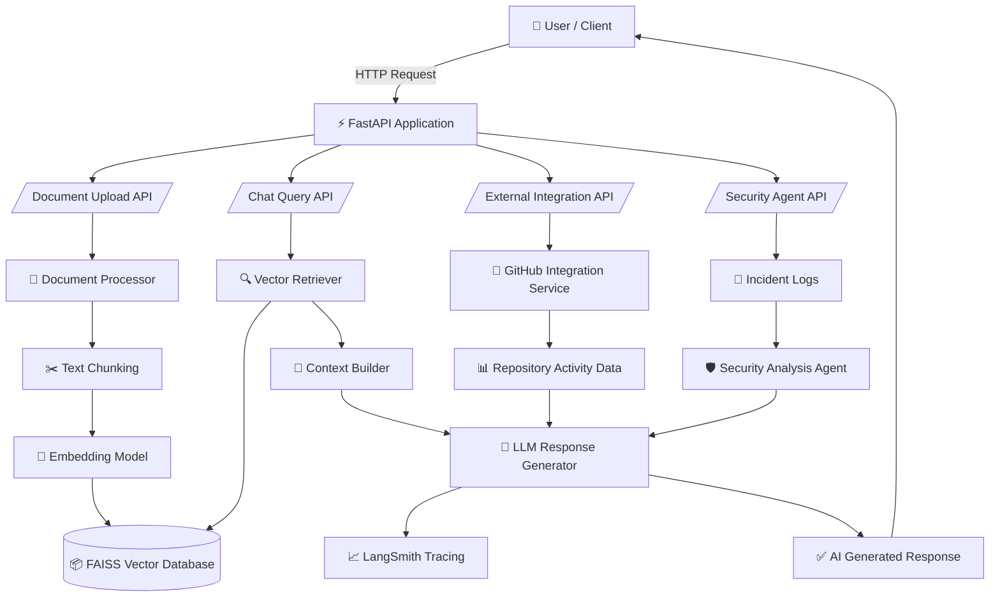

<div align="center">

# 🤖 Mini Enterprise AI Assistant

### Enterprise AI Backend with Retrieval-Augmented Generation, External Integrations & Agentic Log Analysis

[](https://www.python.org/downloads/)
[](https://fastapi.tiangolo.com)
[](https://python.langchain.com)
[](LICENSE)
[](https://github.com/features/actions)
[](https://www.docker.com/)
[](https://aws.amazon.com/apprunner/)

[Features](#-features) •
[Quick Start](#-quick-start) •
[API Docs](#-api-endpoints) •
[Deployment](#-deployment) •
[Contributing](#-contributing)


</div>

---

## 📖 Overview

The Mini Enterprise AI Assistant is a backend AI system designed to demonstrate how enterprises can use modern AI technologies to interact with internal data, external systems, and operational logs through natural language.

### 🎯 Project Description

The application is built using FastAPI, LangChain, and a vector database powered by FAISS to implement a Retrieval-Augmented Generation (RAG) pipeline.

This project enables three primary capabilities:

Document-Based Question Answering (RAG)
Users can upload documents such as policies, reports, or manuals. These documents are processed, converted into embeddings, and stored in a vector database. The assistant retrieves relevant context from these documents to generate accurate answers to user questions.

External System Integration
The system integrates with external services (such as GitHub activity simulation) to fetch operational data and summarize it using AI. This demonstrates how enterprise assistants can connect with tools used in real workflows.

Agentic Security Log Analysis
The assistant analyzes operational or incident logs and produces structured insights such as detected issues, severity levels, and recommended actions.

Overall, the project showcases how an AI-powered backend can combine RAG pipelines, API integrations, and intelligent agents to support enterprise decision-making and knowledge retrieval.

---

## ✨ Features

### 📄 Document Management
- ✅ Upload **PDF**, **TXT**, and **CSV** files
- ✅ Automatic text extraction and chunking
- ✅ Smart document splitting with overlap
- ✅ Vector storage in local

### 💬 Intelligent Q&A
- ✅ Natural language questions
- ✅ Context-aware answers
- ✅ Source attribution (see which docs were used)
- ✅ Streaming responses for real-time feedback
- ✅ Multiple query modes (standard, search-only)

### 🔍 Observability & Quality
- ✅ **LangSmith Tracing**: Full chain visibility, token tracking, cost analysis
- ✅ **Structured Logging**: Comprehensive error tracking
- ✅ **Health Checks**: Readiness & liveness endpoints

---

## 🏗️ Architecture



### Tech Stack

| Component | Technology | Purpose |
|-----------|------------|---------|
| 🐍 Language | **Python 3.11** | Modern Python with type hints |
| 🚀 API Framework | **FastAPI** | High-performance async API |
| 🧠 RAG Framework | **LangChain** | LLM orchestration |
| 🗄️ Vector DB | **FAISS** | Semantic search |
| 🔢 Embeddings | **text-embedding-3-small** | Document encoding |
| 🤖 LLM | **GPT-4o-mini** | Answer generation |
| 🔍 Observability | **LangSmith** | Tracing & monitoring |

---

## 🚀 Quick Start

### Prerequisites

- 🐍 Python 3.12+
- 🔑 OpenAI API key ([Get one](https://platform.openai.com/api-keys))


### 1️⃣ Install

```bash

# Install with UV (recommended)
uv sync

```

### 2️⃣ Configure Environment

```bash
# Copy environment template
cp .env.example .env

# Edit with your credentials
nano .env
```

**Required variables:**
```bash
OPENAI_API_KEY=sk-proj-your-key-here
```

**Optional - LangSmith Observability:**
```bash
LANGCHAIN_TRACING_V2=true
LANGCHAIN_API_KEY=lsv2_pt_your-key-here
LANGCHAIN_PROJECT=Mini Enterprise AI Assistant
```

### 3️⃣ Run Application

```bash
# Development mode with hot reload
uvicorn app.main:app --reload

# Or using Python
python -m app.main
```

### 4️⃣ Access API

🌐 **Swagger UI**: http://localhost:8000/docs
📚 **ReDoc**: http://localhost:8000/redoc
🔍 **Health Check**: http://localhost:8000/health

---

## 📝 API Endpoints

### Document Management

| Endpoint | Method | Description | Example |
|----------|--------|-------------|---------|
| 📤 `/documents/upload` | POST | Upload document | [See below](#upload-document) |
| ℹ️ `/documents/info` | GET | Get vector stats | `curl /documents/info` |


### Query & Search

| Endpoint | Method | Description | Features |
|----------|--------|-------------|----------|
| 💬 `/chat` | POST | Ask a question | Sources, Evaluation |
| 🔍 `/query/search` | POST | Search only | No generation |

### External System Integration Agent

| Endpoint | Method | Description | Features |
|----------|--------|-------------|----------|
| 💬 `/integration/github-summary` | GET | No generation | 

### Agentic Security Intelligence

| Endpoint | Method | Description | Features |
|----------|--------|-------------|----------|
| 💬 `/agent/analyze` | POST | Ask a question | Summary |


### Health & Monitoring

| Endpoint | Method | Description |
|----------|--------|-------------|
| ❤️ `/health` | GET | Basic health check |

---

## 💡 Usage Examples

### Basic Health Check
```bash
curl -X 'GET' \
  'http://127.0.0.1:8000/health' \
  -H 'accept: application/json'
```
**Response:**
```json
{
  "status": "healthy",
  "timestamp": "2026-03-08T08:22:54.882615",
  "version": "0.1.0"
}
```

### Upload a Document

```bash
curl -X 'POST' \
  'http://127.0.0.1:8000/documents/upload' \
  -H 'accept: application/json' \
  -H 'Content-Type: multipart/form-data' \
  -F 'file=@security_policy.txt;type=text/plain'
```

**Response:**
```json
{
  "message": "Document uploaded and processed successfully",
  "filename": "security_policy.txt",
  "chunks_created": 1,
  "document_ids": [
    "5a05f19e-e0f5-4406-9b28-14e42b2591da"
  ]
}
```

### Ask a Question

```bash
curl -X 'POST' \
  'http://127.0.0.1:8000/chat' \
  -H 'accept: application/json' \
  -H 'Content-Type: application/json' \
  -d '{
  "include_sources": true,
  "question": "What are the key security risks?"
}'
```

**Response:**
```json
{
  "question": "What are the key security risks?",
  "answer": "The key security risks are:\n- Weak password policies\n- Lack of multi-factor authentication\n- Unauthorized access to internal systems\n- Unencrypted data transmission",
  "sources": [
    {
      "content": "Enterprise Security Policy\n\nThe organization enforces strict access control policies to protect sensitive data.\n\nKey Security Risks:\n- Weak password policies\n- Lack of multi-factor authentication\n- Unauthorized access to internal systems\n- Unencrypted data transmission\n\nSecurity Measures:\n- Enforce strong passwords\n- Enable multi-factor authentication (MFA)\n- Monitor login attempts\n- Encrypt sensitive data\n\nFailure to follow these policies may lead to security breaches and compliance violations.",
      "metadata": {
        "source": "security_policy.txt"
      }
    },
    {
      "content": "Enterprise Security Policy\n\nThe organization enforces strict access control policies to protect sensitive data.\n\nKey Security Risks:\n- Weak password policies\n- Lack of multi-factor authentication\n- Unauthorized access to internal systems\n- Unencrypted data transmission\n\nSecurity Measures:\n- Enforce strong passwords\n- Enable multi-factor authentication (MFA)\n- Monitor login attempts\n- Encrypt sensitive data\n\nFailure to follow these policies may lead to security breaches and compliance violations.",
      "metadata": {
        "source": "security_policy.txt"
      }
    },
    {
      "content": "Enterprise Security Policy\n\nThe organization enforces strict access control policies to protect sensitive data.\n\nKey Security Risks:\n- Weak password policies\n- Lack of multi-factor authentication\n- Unauthorized access to internal systems\n- Unencrypted data transmission\n\nSecurity Measures:\n- Enforce strong passwords\n- Enable multi-factor authentication (MFA)\n- Monitor login attempts\n- Encrypt sensitive data\n\nFailure to follow these policies may lead to security breaches and compliance violations.",
      "metadata": {
        "source": "security_policy.txt"
      }
    },
    {
      "content": "Enterprise Security Policy\n\nThe organization enforces strict access control policies to protect sensitive data.\n\nKey Security Risks:\n- Weak password policies\n- Lack of multi-factor authentication\n- Unauthorized access to internal systems\n- Unencrypted data transmission\n\nSecurity Measures:\n- Enforce strong passwords\n- Enable multi-factor authentication (MFA)\n- Monitor login attempts\n- Encrypt sensitive data\n\nFailure to follow these policies may lead to security breaches and compliance violations.",
      "metadata": {
        "source": "security_policy.txt"
      }
    }
  ],
  "processing_time_ms": 3717.26
}
```

### External System Integration Agent

```bash
curl -X 'GET' \
  'http://127.0.0.1:8000/integration/github-summary' \
  -H 'accept: application/json'
```
**Response:**
```json

{
  "source": "github",
  "summary": "Repository enterprise-ai has 3 recent commits."
}
```

### Agentic Security Intelligence

```bash
curl -X 'POST' \
  'http://127.0.0.1:8000/agent/analyze' \
  -H 'accept: application/json' \
  -H 'Content-Type: application/json' \
  -d '{
  "source": "incident_logs"
}'
```
**Response:**
```json
{
  "summary": "### 1. Summary\nThe security logs indicate several critical issues within the system. There is a database timeout error, which may affect system performance and availability. Additionally, there are multiple failed login attempts, suggesting potential brute-force attacks or unauthorized access attempts. An explicit unauthorized access attempt has also been logged, indicating a serious security breach. Finally, a system restart has been completed, which may be a response to the issues detected.\n\n### 2. Severity\n- **Database timeout detected**: MEDIUM\n- **Multiple failed login attempts**: HIGH\n- **Unauthorized access attempt**: HIGH\n- **System restart completed**: LOW\n\n### 3. Recommendations\n1. **Database Timeout Detected**:\n   - Investigate the cause of the database timeout. Check for performance issues, such as slow queries or resource constraints.\n   - Optimize database queries and consider increasing resources if necessary.\n   - Implement monitoring tools to alert on future timeouts.\n\n2. **Multiple Failed Login Attempts**:\n   - Implement account lockout policies after a certain number of failed login attempts to prevent brute-force attacks.\n   - Encourage users to use strong, unique passwords and consider implementing multi-factor authentication (MFA).\n   - Review logs to identify the source of the failed attempts and block any suspicious IP addresses.\n\n3. **Unauthorized Access Attempt**:\n   - Immediately investigate the unauthorized access attempt to determine the source and nature of the attack.\n   - Review user access controls and permissions to ensure that only authorized personnel have access to sensitive areas of the system.\n   - Consider implementing intrusion detection systems (IDS) to monitor for future unauthorized access attempts.\n\n4. **System Restart Completed**:\n   - Ensure that the system restart was performed as a precautionary measure and not due to a critical failure.\n   - Review system logs to confirm that the restart did not cause any additional issues.\n   - Schedule regular maintenance and updates to minimize the need for unexpected restarts.\n\nBy addressing these issues promptly, the security and stability of the system can be improved, reducing the risk of future incidents.",
  "severity": "HIGH",
  "recommendations": [
    "Review access logs",
    "Enable MFA"
  ]
}
```

---


## ⚙️ Configuration

### Environment Variables

| Variable | Default | Description |
|----------|---------|-------------|
| **Required** |||
| `OPENAI_API_KEY` | - | OpenAI API key |
| **Document Processing** |||
| `FIASS VECTOR STORE` |
| `CHUNK_SIZE` | `1000` | Text chunk size |
| `CHUNK_OVERLAP` | `200` | Chunk overlap tokens |
| **AI Models** |||
| `EMBEDDING_MODEL` | `text-embedding-3-small` | OpenAI embedding model |
| `LLM_MODEL` | `gpt-4o-mini` | OpenAI chat model |
| `LLM_TEMPERATURE` | `0.0` | LLM temperature (0-2) |
| **LangSmith Observability** |||
| `LANGCHAIN_TRACING_V2` | `true` | Enable LangSmith tracing |
| `LANGCHAIN_API_KEY` | - | LangSmith API key |
| `LANGCHAIN_PROJECT` | `Mini Enterprise AI Assistant` | Project name |
| **API Settings** |||
| `API_HOST` | `0.0.0.0` | API host |
| `API_PORT` | `8000` | API port |
| `LOG_LEVEL` | `INFO` | Logging level |

---

## 📊 Project Structure

```
enterprise-ai-assistant/
├── 📁 app/                      # Application code
│   ├── main.py                  # FastAPI app entry
│   ├── config.py                # Configuration
|   └── logger.py                # Logging setup
│   ├── 📁 api/
│   │   ├── 📁 routes/           # API endpoints
│   │   │   ├── agent.py          # Health checks
│   │   │   ├── documents.py      # Document management
│   │   │   └── chat.py           # Q&A endpoints
|   |   |   └── integration.py    # Github Integration
|   |   |   └── health.py         # Health checks
│   │   └── schemas.py           # Pydantic models
│   ├── 📁 rag/                 # Business logic
│   │   ├── document_processor.py # Doc loading & chunking
│   │   ├── embeddings.py        # Embedding service
│   │   ├── rag_chain.py         # RAG orchestration
|   ├── 📁agents/                #Agentic Security Intelligence
|   │   └── security_agent.py     #Analyze operational logs and generate insights + recommendations.
|   ├── integrations/              #External System Integration Agent
|   │   └── github_integration.py  #external system and summarize retrieved data 
│   ├── 📁 data/  
|   |   ├── 📁 Documents/          # Text Documents for loading
│   │   ├── security_policy.txt    # Security text file
│   │   ├── github_data.json
│   │   ├──incident_logs.txt
├── pyproject.toml               # Project config (UV)
├── .env.example                 # Environment template
└── README.md                    # This file
```

---

## 📚 Additional Resources

### Documentation
- 📖 [FastAPI Docs](https://fastapi.tiangolo.com/)
- 🦜 [LangChain Docs](https://python.langchain.com/)
- 🤖 [OpenAI API Docs](https://platform.openai.com/docs)
- 🔍 [LangSmith Docs](https://docs.smith.langchain.com/)

---

